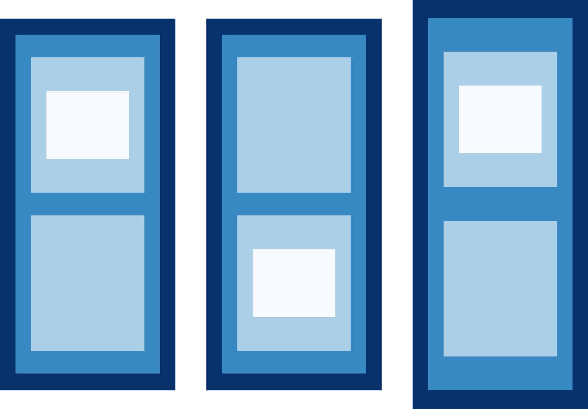
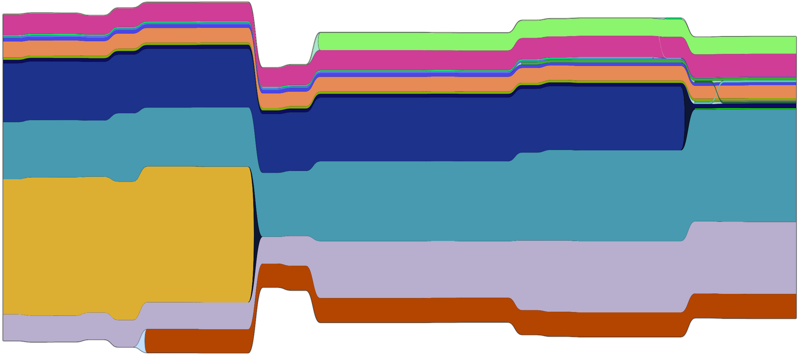
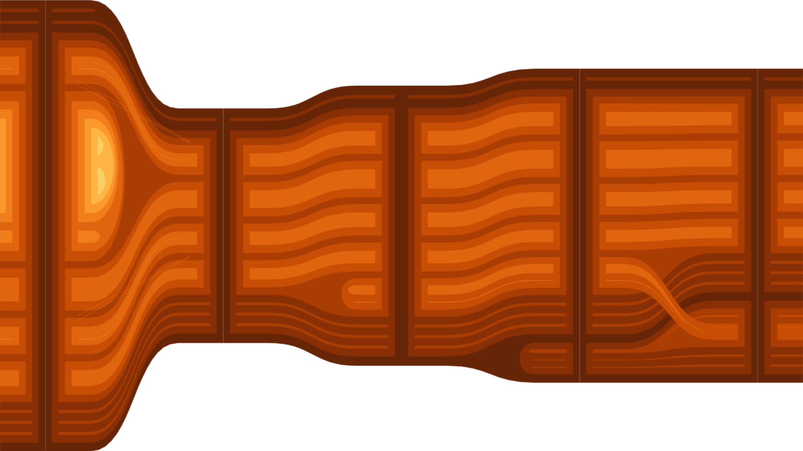
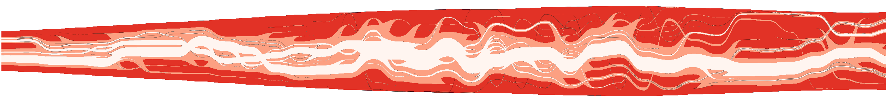
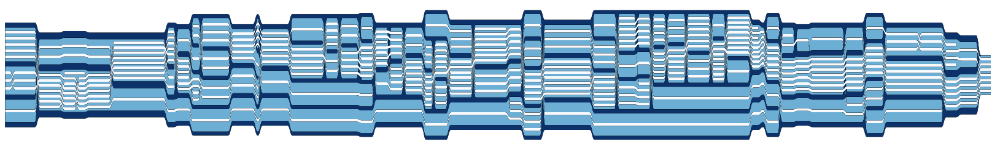

# SplitStreams

**SplitStreams** is a JavaScript library, that allows for the visualization of hierarchically structured data over time. Visualization types include:
- Streamgraphs
- One-dimensional treemaps
- Nested Tracking Graphs (Nested Streamgraphs)
- Storylines, and
- SplitStreams.
  
|||||
|:-:|:-:|:-:|:-:|
|||



We utilize [D3.js](https://d3js.org) to draw SVG elements.

- index.html includes an extensive demo page with several datasets loaded, and many of the parameters exposed as sliders.
- testPage.html shows minimal examples to see how the library handles basic cases.
- generators.html allows for the creation of random datasets (but is still buggy).
- animation.html shows how to create simple animations for presentation purposes

# Getting Started

To run the demo in this repository, use `npm install` and start a development server via `npm run dev`.
To utilize the library in your own project, load the library and create a stream by providing it with a div and data to render.

```js
import * as d3 from 'd3';
import { SplitStream } from './SplitStreams.js';

let div = document.createElement("div");
document.body.appendChild(div);

let stream = new SplitStream(div);
stream.data(myJson);
```

The input data format looks like the following:
```js
let myJson = {
  timesteps: [
    0: {
      references: [
        0: { id: 0, size: 2, parent: null, next: next(A)},
        1: { id: 1, size: 1, parent: parent(0), next: next(B)}
      ],
      tree: root(0)
    },
    1: {
      references: [
        'A': { id: 'A', size: 2, parent: null, prev: [prev(0)] },
        'B': { id: 'B', size: 1, parent: parent(A), prev: [prev(1)] }
      ],
      tree: root (A)
    }
  ]
}
```

If your data format already looks like the previous example, you can use it by calling  `stream.data(myJson)`.
In case your data is using a different format, we provide convenience functions to transform your data:

```js
import { SplitStreamInputData } from './SplitStreams.js';
let format = new SplitStreamInputData();
for (every node of the data)
  for (every timestep the node is active)
      format.addNode(timestep, id, weight);

for (every parent-child relation)
  for (every timestep the relation is active)
    format.addParent(timestep, child_id, parent_id);

format.connectEqualIds();
format.finalize();
return format.data;
```

Several examples of how different data can be converted to our format, are demonstrated in `TransformData.js`. The function `format.connectEqualIds()` connects the nodes of continuous timesteps, if they have the same ID. If IDs are not consistent along timesteps, or when the data includes splits (from one node into multiple nodes) or merges (from multiple nodes into one), we need to utilize the function `format.addNext(timestep, id, nextId)`.


# stream.data(d)

Sets the input data. The data needs to be conform with the SecStreamInputData format.

If d is null, returns the current data.

# stream.filters(d)

Takes an array of SVG filters as defined in /libs/d3svgfilters. Currently supported options are
```js
[
  { type: 'double-inner-shadow', dx: 0, dy: 0, stdDeviation: 0 },
  { type: 'drop-shadow', dx: 0, dy: 0, stdDeviation: 0 }
]
```

# Additional Information
If you use this library, showcase its results, or want to refer to it, please cite [our paper](https://doi.org/10.1109/TVCG.2020.2973564). The survey for our user study can be found [here](https://github.com/cadanox/SplitStreams-Survey).

```
@article{bolte2020splitstreams
  author: {Bolte, Fabian and Nourani, Mahsan and Ragan, Eric D. and Bruckner, Stefan},
  journal: {IEEE Transactions on Visualization and Computer Graphics},
  title: {{SplitStreams}: {A} Visual Metaphor for Evolving Hierarchies},
  year: {2020},
  doi: {10.1109/TVCG.2020.2973564}
}
```

# License

Distributed under the MIT License. See `LICENSE` for more information.

# Contact

Fabian Bolte - fabian.bolte@web.de